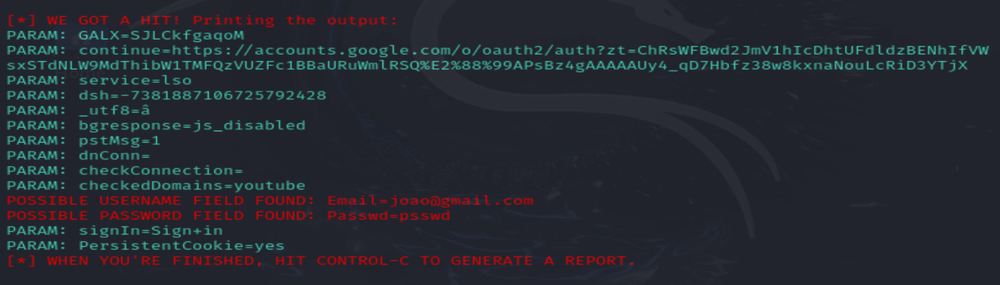

## **Overview**  

This repository demonstrates a phishing simulation for educational and research purposes. The project utilizes Kali Linux and the `setoolkit` (Social Engineering Toolkit) to clone a website and harvest credentials.  

---

## **Tools**  

- **Kali Linux**  
- **setoolkit** (pre-installed in Kali Linux)

---

## **Setup and Configuration**  

### **Step 1: Gain Root Access**  
Run the following command to switch to root access:  
```
sudo su
```

Step 2: Launch the Social Engineering Toolkit

Start the Social Engineering Toolkit by running:
```
setoolkit
```
### **Step 3: Select the Type of Attack**

    1- Choose Social-Engineering Attacks from the menu.
    2- Select Web Site Attack Vectors.
    3- Pick Credential Harvester Attack Method.
    
### **Step 4: Configure the Attack**

    1- Use the Site Cloner option.
    
    2- Obtain the IP address of your machine using the following command:

    ifconfig

    3- Input the URL of the target site to clone:
    
    http://www.google.com      
    
    
### **Step 5: Start the Phishing Simulation**

The Social Engineering Toolkit will create a cloned version of the target website.
When users interact with this page and input credentials, the data will be harvested and saved locally.    

### **Results**
Once a user submits their credentials, they are captured and saved to a log file. Below is an example screenshot of harvested data:


